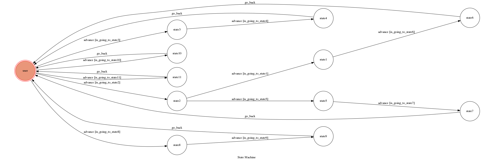

## Setup

### Prerequisite
* Python 3.6
* Pipenv
* Facebook Page and App
* HTTPS Server


**`ngrok` would be used in the following instruction**

```sh
ngrok http 8000
```

After that, `ngrok` would generate a https URL.

#### Run the sever

```sh
python3 app.py
```
## Finite State Machine


## 功能
最一開始的state是user
輸入隨意文字會跳出提示訊息


##輸入幫助後


#按鈕按下 今日油圖後

## 會隨機顯示今天pixiv上排名前三的作品
##輸入[id]後回到user狀態

##按下查詢按鈕，之後輸入想要查詢的圖片編號
##若是多張圖片同一編號的，後面需要加-編號


## 按下我的油圖的按鈕後會顯示目前儲存的油圖編號


##按下編輯我的油圖後可以進行刪減


## Heroku
有設計可以在heroku上面執行，也可以用ngrok在本機執行

##Bonus
###我額外使用的bonusu有:
###1.傳送圖片
###2.爬蟲:自動尋找pixiv排行榜上的前三名
###3.database:用json擋去記錄自己喜好的圖片，且可以編輯


